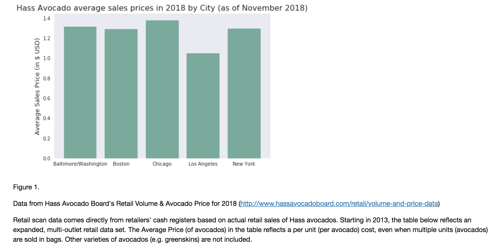

# PUI2018 HW 11

## ASSIGNMENTS:

### Assignment 1. Here, I had to complete the [skeleton notebook] which involved working with a Numpy datacube, producing a time series analysis and training a decision tree model.

### Assignment 2. Here, I needed to improve my plot from HW8 based on the feedback I recieved from your classmates. 

My reviewers thought my graph was fair and clear. Based on their suggestions, I removed the gridlines to impore the graph. 

