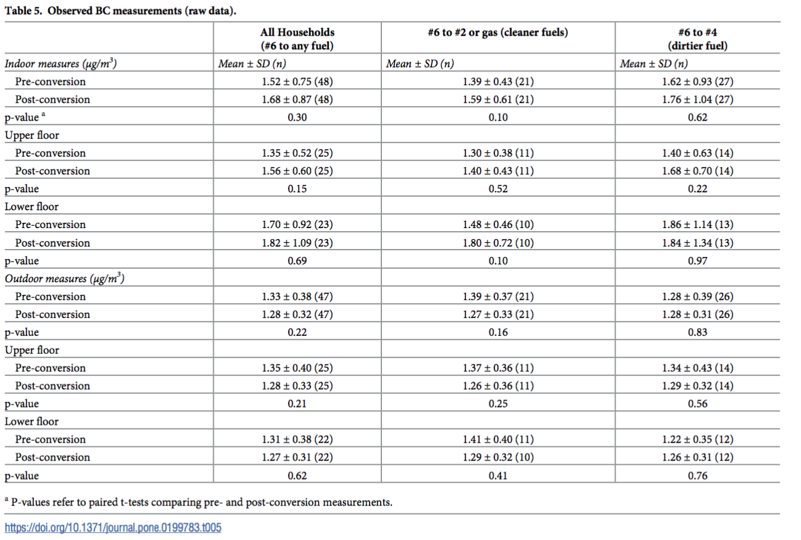
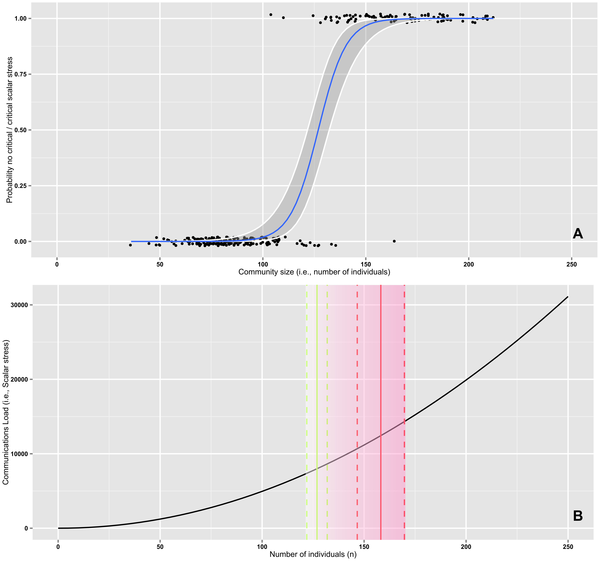

`Statement: I am using the 72-hour late extension for this homework`

Assignment 1: 
Here, I needed to review my classmate's hypotheses on Citibike data, propose a statistical test, and submit a pull request to their original repository. 

A copy of the .md file I pushed to Karan's repo is in this folder and is called HW5_Assignment1_tm1722.md

Here is the screenshot of my pull request: 

Assignment 2: 
Here, I needed to explore scientific papers and fill out a table about statistical analyses. The table is at the end of this file along with screenshots from each paper. 

Assignment 3: 
Here, I needed to reproduce the analysis of the Hard to Employ program NY by filling out and modifying a skeleton notebook provided. 

Can be found in HW5_Assignment3_tm177.ipyn file

Assignment 4: 

Here, I needed to use the scipy package with CitiBiki data and perform K-S Two-Sample test and two samples for correlation (Pearson's and Spearman's)

| **Statistical Analyses** |  **IV(s)**  |  **IV type(s)** |  **DV(s)**  |  **DV type(s)**  |  **Control Var** | **Control Var type**  | **Question to be answered** | **_H0_** | **alpha** | **link to paper**| 
|:----------:|:----------|:------------|:-------------|:-------------|:------------|:------------- |:----------------------------------|:----:|:-------:|:-------|
t-test (dependent two-tailed t-test) | 1, Assessment type (Possible values: before change, after change) | categorical | 1, Indoor black carbon (BC) level| interval | (none) | (none) |  Does the fuel conversion from dirty No. 6 heating fuel oil to a cleaner No. 2 fuel for 48 upper Manhattan apartments decrease the average two week levels of indoor black carbon (BC) in successive winter heating sessions before and after mandated fuel transition? | H0: Mean(two week BC indoor level before transition) - Mean(two week BC indoor level after transition) = 0 | 0.05 | [Soot and the city: Evaluating the impacts of Clean Heat policies on indoor/outdoor air quality in New York City apartments](https://journals.plos.org/plosone/article/file?id=10.1371/journal.pone.0199783&type=printable) |
|||||||||
Correlation | 2, Mimicry Score, Assesed personality scale | ordinal, interval | researchers were focused on just correlations and didn't make a predictive model, so no dependent variables| (none) | (none) | (none) |  Do two methods of measuring people's tendency to imitate each other correlate (since they are assumed to rely on the same mechanisms? Are phenomena of mimicry and automation imitation actually correlated? | H0: mimicry score and the assessed personality scales are correlated | 0.05 | [Mimicry and automatic imitation are not correlated](https://journals.plos.org/plosone/article/file?id=10.1371/journal.pone.0183784&type=printable) |
|||||||||
Logistic Regression | 1, Community Size (number of individuals) | interval | Critical level of scalar stress (Possible values: 1 = presence of colony fissioning, 0 = absence of colony fissioning)| categorical (binary) | (none) | (none) |  Can we build a statistical model to prove Johnson's scalar stress theory, describing the mechanics of the increase in in-group conflictuality that parallels the increase in groups’ size? Can we predict the critical level of scalar stress using group size? | H0: there is no relationship between the group size and the critical level of scalar stress | 0.05 | [Modeling Group Size and Scalar Stress by Logistic Regression from an Archaeological Perspective](https://journals.plos.org/plosone/article/file?id=10.1371/journal.pone.0091510&type=printable) |

T-test screenshot: 

