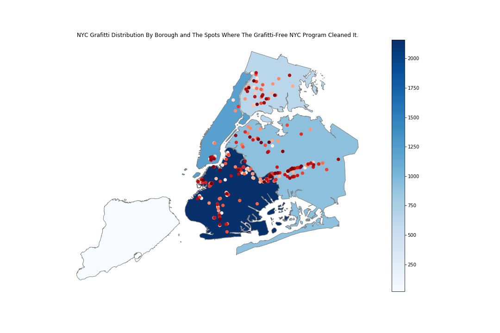

__Tanya Nabila’s plot review by Timur Mukhtarov__

CLARITY: Overall the plot is easy to read as it is a map of New York (highly recognizable unlike a lot of cities). The plot plots two things — graffiti distribution by borough (choropleth in blue shades) and spots where the graffiti were cleaned (red spots). There is a legend indicating scale for distribution by boroughs. It’s pretty intuitive. However, there is no legend for the colors of red dots — there are multiple shades of red and it’s hard to know what they mean. I would suggest adding another legend describing what they mean.

ESTHETIC: I think that choosing a map is wise here since that allows for showing multiple things (graffiti distribution and spots where graffiti were cleaned). For the spots specifically, I like that we can see where the graffiti are clustered (for example, there are a lot in Bushwick and LES as expected, but also a lot in Queens). I find the colors appropriate and conducive to the experience as well.

HONESTY: is the plot honestly reproducing the data or is it deforming it, perhaps to emphasize a point? I think the plot reproduces the data well for the most part. One improvement I would suggest is stating the timeframe the data was collected. Right now, I would think that the data is for this or last year, but who knows, maybe it’s for 10 years ago and things are really different now. 